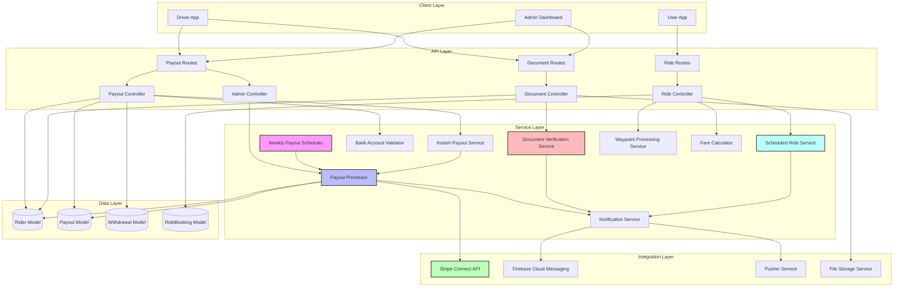
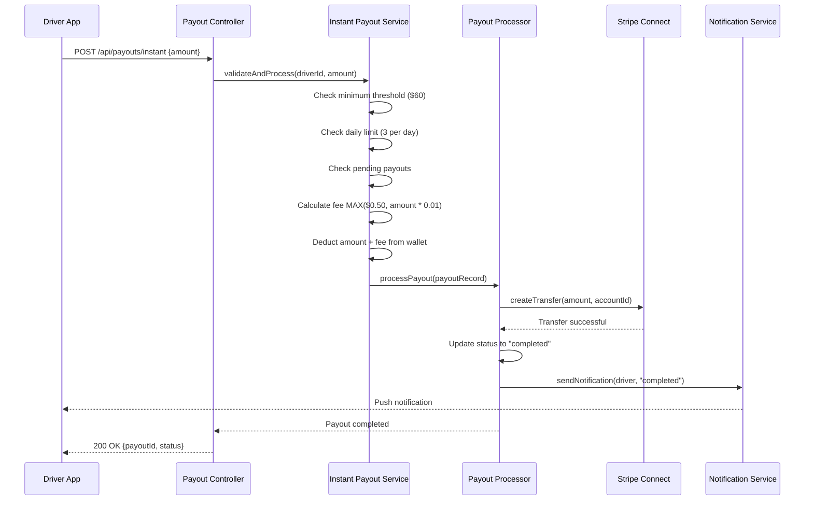
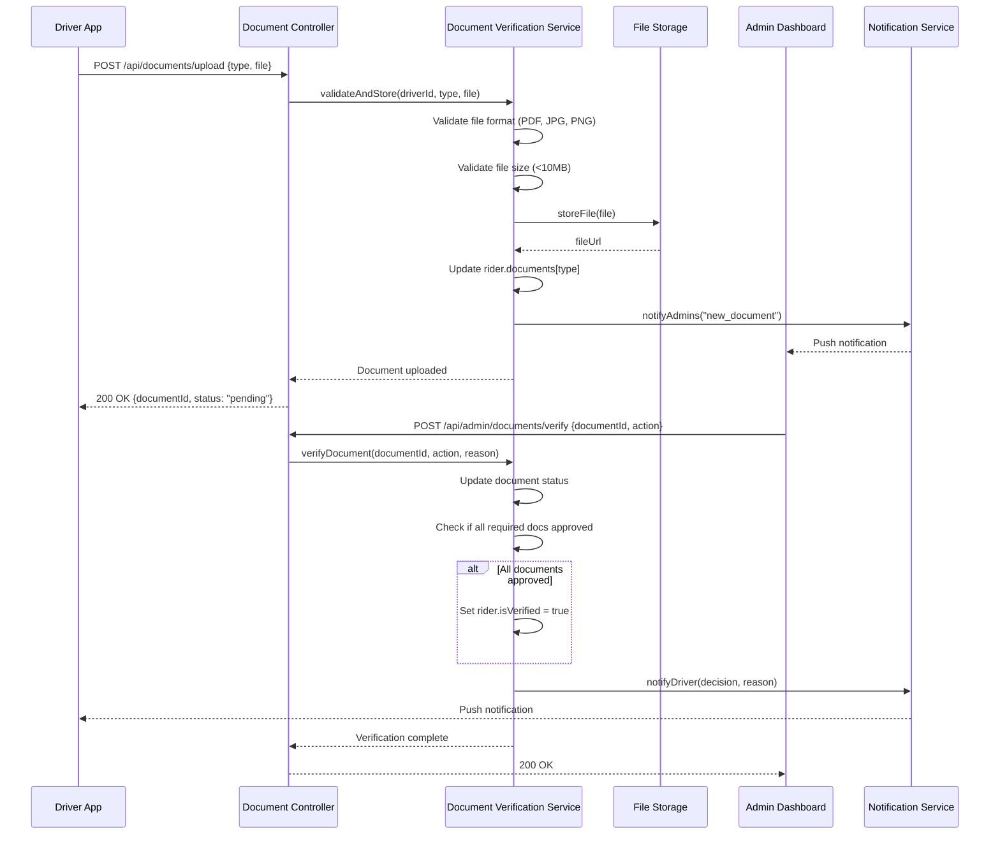
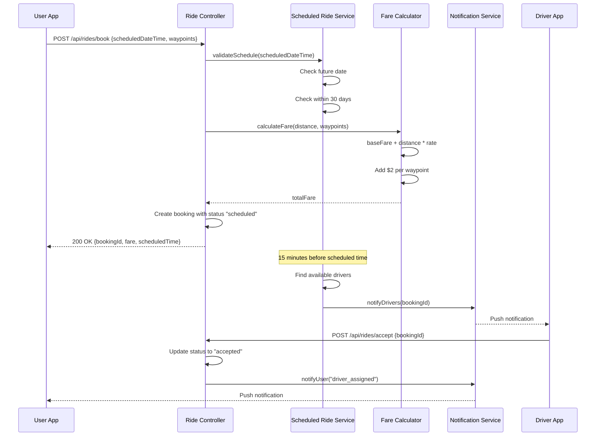

# Design Document: Driver Payouts System

## Overview

The Driver Payouts System is a comprehensive financial management solution that enables drivers (riders) in the Ridelynk platform to withdraw their earnings through two distinct methods: automated weekly payouts and on-demand instant payouts. The system integrates with Stripe Connect for secure fund transfers, implements robust validation and security controls, provides comprehensive audit trails, and offers administrative oversight capabilities. Additionally, the system includes driver document verification, scheduled ride booking, and support for multiple stops/waypoints in rides.

### Key Features

- **Automated Weekly Payouts**: Scheduled batch processing every Monday at 00:00 UTC
- **Instant Payouts**: On-demand withdrawals with $60 minimum threshold, configurable fees, and daily limits
- **Stripe Connect Integration**: Secure fund transfers to driver bank accounts
- **Bank Account Management**: Encrypted storage and validation of payment information
- **Driver Document Verification**: Upload, storage, and admin approval workflow for driver documents
- **Scheduled Ride Booking**: Advance ride scheduling with time-based driver matching
- **Multiple Stops Support**: Waypoint management with per-stop fees and route tracking
- **Comprehensive Tracking**: Complete payout history with status transitions
- **Admin Dashboard**: Monitoring, management, and manual approval capabilities
- **Notification System**: Real-time updates for all payout and verification events
- **Security Controls**: Fraud prevention, rate limiting, and encryption
- **Failure Recovery**: Automatic retry logic with exponential backoff

### Design Goals

1. **Reliability**: Ensure all payouts are processed accurately with proper error handling
2. **Security**: Protect sensitive financial data and prevent fraudulent transactions
3. **Scalability**: Handle growing driver base with efficient batch processing
4. **Auditability**: Maintain complete audit trails for compliance and debugging
5. **User Experience**: Provide clear status updates and fast instant payouts
6. **Verification Integrity**: Ensure only verified drivers with approved documents can receive payouts
7. **Maintainability**: Clean architecture with separation of concerns

## Architecture

### System Components



### Component Responsibilities

#### Client Layer
- **Driver App**: Mobile application for drivers to manage payouts, upload documents, and view ride history
- **User App**: Mobile application for users to book rides with scheduling and waypoints
- **Admin Dashboard**: Web interface for administrators to manage payouts, verify documents, and monitor system

#### API Layer
- **Payout Routes**: REST endpoints for payout operations (request, history, status)
- **Payout Controller**: Business logic for payout request handling and validation
- **Admin Controller**: Administrative operations for payout management and approval
- **Document Routes**: REST endpoints for document upload and retrieval
- **Document Controller**: Business logic for document management and verification workflow
- **Ride Routes**: REST endpoints for ride booking with scheduling and waypoints
- **Ride Controller**: Business logic for ride creation, matching, and tracking

#### Service Layer
- **Weekly Payout Scheduler**: Cron job that triggers automated weekly payouts
- **Instant Payout Service**: Handles on-demand payout requests with validation
- **Payout Processor**: Core payout execution engine with Stripe integration
- **Bank Account Validator**: Validates and sanitizes bank account information
- **Document Verification Service**: Manages document upload, storage, and verification workflow
- **Scheduled Ride Service**: Handles ride scheduling and time-based driver matching
- **Waypoint Processing Service**: Manages waypoint validation, ordering, and tracking
- **Fare Calculator**: Calculates fares including distance, time, waypoints, and fees
- **Notification Service**: Sends push notifications and in-app messages

#### Integration Layer
- **Stripe Connect API**: Payment processing and fund transfers
- **Firebase Cloud Messaging**: Push notifications to mobile devices
- **Pusher Service**: Real-time updates for ride status and location
- **File Storage Service**: Secure storage for driver documents (local or cloud)

#### Data Layer
- **Rider Model**: Driver profiles with wallet, bank account, documents, and verification status
- **Payout Model**: Payout transaction records (to be created)
- **Withdrawal Model**: Legacy withdrawal records (existing)
- **RideBooking Model**: Ride bookings with scheduling and waypoint support

### Data Flow Diagrams

#### Instant Payout Flow



#### Document Verification Flow



#### Scheduled Ride Booking Flow



## Components and Interfaces

### 1. Document Verification Service

**Purpose**: Manages driver document upload, storage, and admin verification workflow.

**Key Methods**:
```javascript
class DocumentVerificationService {
  /**
   * Upload and store a driver document
   * @param {string} driverId - Driver's ID
   * @param {string} documentType - Type: license, insurance, vehicle_registration, other
   * @param {File} file - Document file
   * @returns {Promise<Document>} Uploaded document with status "pending"
   */
  async uploadDocument(driverId, documentType, file)
  
  /**
   * Validate document file
   * @param {File} file - Document file
   * @returns {boolean} True if valid
   * @throws {ValidationError} If invalid format or size
   */
  validateDocumentFile(file)
  
  /**
   * Verify document (approve/reject)
   * @param {string} documentId - Document ID
   * @param {string} action - "approve" or "reject"
   * @param {string} adminId - Admin performing action
   * @param {string} reason - Rejection reason (required if rejecting)
   * @returns {Promise<Document>} Updated document
   */
  async verifyDocument(documentId, action, adminId, reason)
  
  /**
   * Check if driver has all required documents approved
   * @param {string} driverId - Driver's ID
   * @returns {Promise<boolean>} True if all required docs approved
   */
  async isDriverFullyVerified(driverId)
  
  /**
   * Get pending documents for admin review
   * @param {Object} filters - Filter options (documentType, driverId)
   * @param {Object} pagination - Page and limit
   * @returns {Promise<Array<Document>>} Pending documents
   */
  async getPendingDocuments(filters, pagination)
}
```

**Validation Rules**:
- Supported formats: PDF, JPG, JPEG, PNG
- Maximum file size: 10MB
- Required document types: license, insurance, vehicle_registration
- One document per type per driver (replaces previous if re-uploaded)

**Document Status Flow**:
```
pending → approved (driver becomes eligible for payouts)
pending → rejected (driver must re-upload)
```

### 2. Scheduled Ride Service

**Purpose**: Handles ride scheduling with advance date/time selection and time-based driver matching.

**Key Methods**:
```javascript
class ScheduledRideService {
  /**
   * Validate scheduled date/time
   * @param {Date} scheduledDateTime - Requested schedule time
   * @returns {boolean} True if valid
   * @throws {ValidationError} If invalid
   */
  validateScheduledDateTime(scheduledDateTime)
  
  /**
   * Create scheduled ride booking
   * @param {Object} bookingData - Ride details with scheduledDateTime
   * @returns {Promise<RideBooking>} Created booking with status "scheduled"
   */
  async createScheduledRide(bookingData)
  
  /**
   * Process scheduled rides (runs every minute)
   * Finds rides scheduled for 15 minutes from now and attempts driver matching
   */
  async processScheduledRides()
  
  /**
   * Match scheduled ride with available drivers
   * @param {string} bookingId - Scheduled booking ID
   * @returns {Promise<boolean>} True if driver found
   */
  async matchScheduledRide(bookingId)
  
  /**
   * Cancel scheduled ride
   * @param {string} bookingId - Booking ID
   * @param {string} userId - User cancelling
   * @returns {Promise<RideBooking>} Updated booking
   * @throws {Error} If within 5 minutes of scheduled time
   */
  async cancelScheduledRide(bookingId, userId)
}
```

**Validation Rules**:
- scheduledDateTime must be in the future
- scheduledDateTime must be within 30 days
- Cannot cancel within 5 minutes of scheduled time
- Driver matching starts 15 minutes before scheduled time
- If no driver accepts within 10 minutes, status becomes "no_driver_available"

### 3. Waypoint Processing Service

**Purpose**: Manages multiple stops/waypoints in ride bookings with validation, ordering, and tracking.

**Key Methods**:
```javascript
class WaypointProcessingService {
  /**
   * Validate waypoints array
   * @param {Array<Waypoint>} waypoints - Array of waypoints
   * @returns {boolean} True if valid
   * @throws {ValidationError} If invalid
   */
  validateWaypoints(waypoints)
  
  /**
   * Calculate total distance including waypoints
   * @param {Location} pickup - Pickup location
   * @param {Array<Waypoint>} waypoints - Intermediate stops
   * @param {Location} destination - Final destination
   * @returns {Promise<number>} Total distance in km
   */
  async calculateTotalDistance(pickup, waypoints, destination)
  
  /**
   * Track waypoint arrival/departure
   * @param {string} bookingId - Ride booking ID
   * @param {number} waypointIndex - Index of waypoint
   * @param {string} event - "arrived" or "departed"
   * @returns {Promise<RideBooking>} Updated booking
   */
  async trackWaypointEvent(bookingId, waypointIndex, event)
  
  /**
   * Update waypoints before ride acceptance
   * @param {string} bookingId - Booking ID
   * @param {Array<Waypoint>} newWaypoints - Updated waypoints
   * @returns {Promise<RideBooking>} Updated booking with recalculated fare
   * @throws {Error} If ride already accepted
   */
  async updateWaypoints(bookingId, newWaypoints)
}
```

**Validation Rules**:
- Minimum 0 waypoints, maximum 5 waypoints
- Each waypoint must have: latitude, longitude, address
- Waypoints stored in order between pickup and destination
- Per-stop fee: $2 USD per waypoint
- Waypoints can only be modified before driver acceptance

### 4. Fare Calculator (Enhanced)

**Purpose**: Calculate ride fares including base fare, distance, time, waypoints, and fees.

**Key Methods**:
```javascript
class FareCalculator {
  /**
   * Calculate total fare for ride
   * @param {Object} rideDetails - Ride information
   * @param {number} rideDetails.distance - Total distance in km
   * @param {number} rideDetails.estimatedTime - Estimated time in minutes
   * @param {Array<Waypoint>} rideDetails.waypoints - Waypoints array
   * @param {string} rideDetails.vehicleType - Vehicle type
   * @returns {Object} Fare breakdown
   */
  calculateFare(rideDetails)
  
  /**
   * Calculate waypoint fees
   * @param {Array<Waypoint>} waypoints - Waypoints array
   * @returns {number} Total waypoint fees ($2 per waypoint)
   */
  calculateWaypointFees(waypoints)
  
  /**
   * Calculate instant payout fee
   * @param {number} amount - Payout amount
   * @returns {number} Fee amount MAX($0.50, amount * 0.01)
   */
  calculateInstantPayoutFee(amount)
}
```

**Fare Calculation Formula**:
```
totalFare = baseFare + (distance * ratePerKm) + (time * ratePerMinute) + (waypointCount * $2)
```

**Instant Payout Fee Formula**:
```
fee = MAX($0.50, amount * 0.01)
```

### 5. Instant Payout Service (Updated)

**Purpose**: Handle on-demand payout requests with updated $60 minimum threshold.

**Key Changes**:
- Minimum threshold updated from $6 to $60
- All validation and fee calculation logic remains the same

**Validation Rules**:
- Minimum payout amount: $60 USD (updated)
- Maximum daily instant payouts: 3
- Fee: MAX($0.50, amount * 0.01)
- Driver must be verified (all documents approved)
- Driver must have valid bank account
- No pending payouts allowed

## Data Models

### Rider Model (Enhanced)

```javascript
{
  // Existing fields...
  
  // Enhanced documents structure
  documents: {
    license: {
      licenseNumber: String,
      expiryDate: Date,
      frontImage: String,  // File URL
      backImage: String,   // File URL
      status: {
        type: String,
        enum: ["pending", "approved", "rejected"],
        default: "pending"
      },
      rejectionReason: String,
      uploadedAt: Date,
      reviewedAt: Date,
      reviewedBy: ObjectId  // Admin ID
    },
    insurance: {
      provider: String,
      policyNumber: String,
      expiryDate: Date,
      documentUrl: String,  // File URL
      status: {
        type: String,
        enum: ["pending", "approved", "rejected"],
        default: "pending"
      },
      rejectionReason: String,
      uploadedAt: Date,
      reviewedAt: Date,
      reviewedBy: ObjectId
    },
    vehicleRegistration: {
      documentUrl: String,  // File URL
      registrationNumber: String,
      status: {
        type: String,
        enum: ["pending", "approved", "rejected"],
        default: "pending"
      },
      rejectionReason: String,
      uploadedAt: Date,
      reviewedAt: Date,
      reviewedBy: ObjectId
    },
    profilePhoto: {
      url: String,
      status: {
        type: String,
        enum: ["pending", "approved", "rejected"],
        default: "pending"
      },
      uploadedAt: Date,
      reviewedAt: Date,
      reviewedBy: ObjectId
    }
  },
  
  // Verification status
  isVerified: {
    type: Boolean,
    default: false
  },
  
  verificationStatus: {
    type: String,
    enum: ["pending", "in_review", "approved", "rejected"],
    default: "pending"
  },
  
  // Wallet fields
  walletBalance: {
    type: Number,
    default: 0
  },
  
  totalWithdrawn: {
    type: Number,
    default: 0
  },
  
  // Bank account
  bankAccount: {
    accountTitle: String,
    accountNumber: String,  // Encrypted
    bankName: String,
    routingNumber: String,  // 9 digits
    branchCode: String,
    cardNumber: String,     // For instant payouts, encrypted
    isVerified: Boolean
  },
  
  // Stripe Connect
  stripeConnectAccountId: String,
  connectChargesEnabled: Boolean,
  connectPayoutsEnabled: Boolean
}
```

### RideBooking Model (Enhanced)

```javascript
{
  // Existing fields...
  
  // Scheduling support
  scheduledDateTime: {
    type: Date,
    default: null  // null for immediate rides
  },
  
  isScheduled: {
    type: Boolean,
    default: false
  },
  
  // Waypoints support
  waypoints: [{
    latitude: {
      type: Number,
      required: true
    },
    longitude: {
      type: Number,
      required: true
    },
    address: {
      type: String,
      required: true
    },
    arrivalTime: Date,
    departureTime: Date,
    sequence: Number  // Order in route
  }],
  
  // Enhanced fare breakdown
  fareBreakdown: {
    baseFare: Number,
    distanceFare: Number,
    timeFare: Number,
    waypointFees: Number,  // $2 per waypoint
    totalFare: Number
  },
  
  // Status tracking
  status: {
    type: String,
    enum: [
      "scheduled",           // New status
      "pending",
      "accepted",
      "onTheWay",
      "arrived",
      "inProgress",
      "completed",
      "cancelled",
      "rejected",
      "no_driver_available"  // New status for scheduled rides
    ]
  },
  
  // Timestamps
  scheduledAt: Date,
  matchingStartedAt: Date,  // When driver matching began
  acceptedAt: Date,
  completedAt: Date
}
```

### Payout Model (New)

```javascript
{
  rider: {
    type: ObjectId,
    ref: "Rider",
    required: true,
    index: true
  },
  
  amount: {
    type: Number,
    required: true,
    min: 0
  },
  
  fee: {
    type: Number,
    default: 0
  },
  
  netAmount: {
    type: Number,  // amount - fee
    required: true
  },
  
  type: {
    type: String,
    enum: ["weekly", "instant"],
    required: true
  },
  
  status: {
    type: String,
    enum: [
      "pending",
      "pending_approval",  // For manual approval
      "processing",
      "completed",
      "failed",
      "rejected"
    ],
    default: "pending",
    index: true
  },
  
  bankAccount: {
    accountTitle: String,
    accountNumber: String,  // Masked (last 4 digits)
    bankName: String,
    branchCode: String
  },
  
  stripeTransferId: String,
  
  failureReason: String,
  
  rejectionReason: String,
  
  retryCount: {
    type: Number,
    default: 0
  },
  
  processedBy: {
    type: ObjectId,
    ref: "Admin"
  },
  
  approvedBy: {
    type: ObjectId,
    ref: "Admin"
  },
  
  rejectedBy: {
    type: ObjectId,
    ref: "Admin"
  },
  
  statusHistory: [{
    status: String,
    timestamp: Date,
    reason: String,
    changedBy: ObjectId
  }],
  
  createdAt: {
    type: Date,
    default: Date.now,
    index: true
  },
  
  processedAt: Date,
  completedAt: Date,
  failedAt: Date
}
```

## API Endpoints

### Document Management

#### Upload Document
```
POST /api/rider/documents/upload
Content-Type: multipart/form-data

Body:
{
  documentType: "license" | "insurance" | "vehicle_registration" | "other",
  file: File
}

Response 200:
{
  success: true,
  document: {
    id: "doc_123",
    type: "license",
    status: "pending",
    uploadedAt: "2024-01-15T10:30:00Z"
  }
}

Response 400:
{
  success: false,
  error: "Invalid file format. Supported: PDF, JPG, PNG"
}
```

#### Get Driver Documents
```
GET /api/rider/documents

Response 200:
{
  success: true,
  documents: {
    license: {
      status: "approved",
      uploadedAt: "2024-01-15T10:30:00Z",
      reviewedAt: "2024-01-16T09:00:00Z"
    },
    insurance: {
      status: "pending",
      uploadedAt: "2024-01-15T10:35:00Z"
    },
    vehicleRegistration: {
      status: "rejected",
      rejectionReason: "Document expired",
      uploadedAt: "2024-01-15T10:40:00Z"
    }
  },
  isFullyVerified: false
}
```

### Admin Document Verification

#### Get Pending Documents
```
GET /api/admin/documents/pending?page=1&limit=20&documentType=license

Response 200:
{
  success: true,
  documents: [{
    id: "doc_123",
    driver: {
      id: "rider_456",
      name: "John Doe",
      email: "john@example.com"
    },
    documentType: "license",
    fileUrl: "/uploads/documents/doc_123.pdf",
    uploadedAt: "2024-01-15T10:30:00Z",
    status: "pending"
  }],
  pagination: {
    page: 1,
    limit: 20,
    total: 45,
    pages: 3
  }
}
```

#### Verify Document
```
POST /api/admin/documents/verify

Body:
{
  documentId: "doc_123",
  driverId: "rider_456",
  documentType: "license",
  action: "approve" | "reject",
  reason: "Document expired"  // Required if rejecting
}

Response 200:
{
  success: true,
  document: {
    id: "doc_123",
    status: "approved",
    reviewedAt: "2024-01-16T09:00:00Z",
    reviewedBy: "admin_789"
  },
  driverVerified: true  // If all required docs now approved
}
```

### Scheduled Ride Booking

#### Create Scheduled Ride
```
POST /api/rides/book

Body:
{
  pickupLocation: {
    latitude: 40.7128,
    longitude: -74.0060,
    address: "123 Main St, New York, NY"
  },
  dropoffLocation: {
    latitude: 40.7589,
    longitude: -73.9851,
    address: "456 Park Ave, New York, NY"
  },
  scheduledDateTime: "2024-01-20T14:30:00Z",  // Optional
  waypoints: [  // Optional
    {
      latitude: 40.7489,
      longitude: -73.9680,
      address: "789 Broadway, New York, NY"
    }
  ],
  vehicleType: "sedan",
  paymentType: "Card"
}

Response 200:
{
  success: true,
  booking: {
    id: "booking_123",
    status: "scheduled",
    scheduledDateTime: "2024-01-20T14:30:00Z",
    fare: {
      baseFare: 5.00,
      distanceFare: 12.50,
      waypointFees: 2.00,
      totalFare: 19.50
    },
    waypoints: [{
      latitude: 40.7489,
      longitude: -73.9680,
      address: "789 Broadway, New York, NY",
      sequence: 1
    }]
  }
}

Response 400:
{
  success: false,
  error: "Scheduled time must be in the future"
}
```

#### Update Waypoints
```
PUT /api/rides/:bookingId/waypoints

Body:
{
  waypoints: [
    {
      latitude: 40.7489,
      longitude: -73.9680,
      address: "789 Broadway, New York, NY"
    },
    {
      latitude: 40.7589,
      longitude: -73.9751,
      address: "321 5th Ave, New York, NY"
    }
  ]
}

Response 200:
{
  success: true,
  booking: {
    id: "booking_123",
    waypoints: [...],
    fare: {
      totalFare: 23.50  // Recalculated
    }
  }
}

Response 400:
{
  success: false,
  error: "Cannot modify waypoints after driver acceptance"
}
```

### Instant Payout (Updated)

#### Request Instant Payout
```
POST /api/payouts/instant

Body:
{
  amount: 100.00
}

Response 200:
{
  success: true,
  payout: {
    id: "payout_123",
    amount: 100.00,
    fee: 1.00,  // MAX($0.50, 100 * 0.01) = $1.00
    netAmount: 99.00,
    status: "processing",
    createdAt: "2024-01-15T10:30:00Z"
  }
}

Response 400:
{
  success: false,
  error: "Minimum payout amount is $60"  // Updated threshold
}

Response 403:
{
  success: false,
  error: "Driver verification incomplete. Please upload and get all required documents approved."
}
```

## Error Handling

### Document Verification Errors

| Error Code | Message | Resolution |
|------------|---------|------------|
| DOC_INVALID_FORMAT | Invalid file format. Supported: PDF, JPG, PNG | Upload file in supported format |
| DOC_TOO_LARGE | File size exceeds 10MB limit | Compress or resize file |
| DOC_ALREADY_PENDING | Document already pending review | Wait for admin review |
| DOC_NOT_FOUND | Document not found | Check document ID |
| DOC_ALREADY_VERIFIED | Document already verified | No action needed |

### Scheduled Ride Errors

| Error Code | Message | Resolution |
|------------|---------|------------|
| SCHEDULE_PAST_DATE | Scheduled time must be in the future | Select future date/time |
| SCHEDULE_TOO_FAR | Cannot schedule rides more than 30 days in advance | Select date within 30 days |
| SCHEDULE_CANCEL_TOO_LATE | Cannot cancel within 5 minutes of scheduled time | Contact support |
| SCHEDULE_NO_DRIVER | No driver available for scheduled ride | Reschedule or book immediate ride |

### Waypoint Errors

| Error Code | Message | Resolution |
|------------|---------|------------|
| WAYPOINT_LIMIT_EXCEEDED | Maximum 5 stops allowed per ride | Reduce number of waypoints |
| WAYPOINT_INVALID_COORDS | Invalid waypoint coordinates | Provide valid latitude/longitude |
| WAYPOINT_MISSING_ADDRESS | Waypoint address required | Provide address for each waypoint |
| WAYPOINT_MODIFY_LOCKED | Cannot modify waypoints after driver acceptance | Cancel and create new booking |

### Payout Errors (Updated)

| Error Code | Message | Resolution |
|------------|---------|------------|
| PAYOUT_BELOW_MINIMUM | Minimum payout amount is $60 | Request amount >= $60 |
| PAYOUT_DAILY_LIMIT | Daily instant payout limit reached (3 per day) | Wait until tomorrow |
| PAYOUT_NOT_VERIFIED | Driver verification incomplete | Upload and get documents approved |
| PAYOUT_NO_BANK_ACCOUNT | Bank account information missing | Add bank account details |

## Testing Strategy

### Unit Tests

**Document Verification Service**:
- File format validation (PDF, JPG, PNG accepted, others rejected)
- File size validation (10MB limit)
- Document type validation
- Document replacement logic (one per type)
- Verification status transitions
- Driver verification status calculation

**Scheduled Ride Service**:
- Date/time validation (future, within 30 days)
- Cancellation time window (5 minutes before)
- Driver matching timing (15 minutes before)
- No driver timeout (10 minutes)
- Status transitions

**Waypoint Processing Service**:
- Waypoint count validation (0-5)
- Coordinate validation
- Address requirement validation
- Distance calculation with waypoints
- Waypoint tracking (arrival/departure)
- Modification restrictions

**Fare Calculator**:
- Base fare calculation
- Distance-based fare
- Waypoint fee calculation ($2 per waypoint)
- Instant payout fee calculation (MAX($0.50, amount * 0.01))
- Total fare aggregation

**Instant Payout Service** (Updated):
- Minimum threshold validation ($60)
- Daily limit enforcement (3 per day)
- Fee calculation
- Verification status check
- Bank account validation

### Integration Tests

**Document Upload Flow**:
- Upload document → Store file → Update rider model → Notify admin
- Admin approve → Update status → Check full verification → Notify driver
- Admin reject → Update status → Store reason → Notify driver

**Scheduled Ride Flow**:
- Create scheduled booking → Store with status "scheduled"
- 15 minutes before → Match with drivers → Update status
- No driver found → Update to "no_driver_available" → Notify user
- Driver accepts → Update status → Notify user

**Waypoint Flow**:
- Create booking with waypoints → Calculate fare → Store waypoints
- Modify waypoints → Recalculate fare → Update booking
- During ride → Track arrival/departure at each waypoint

**Payout Flow with Verification**:
- Request payout → Check verification → Check documents → Process or reject
- Unverified driver → Reject with error message
- Verified driver → Process payout normally

### Property-Based Tests

Property-based testing is appropriate for this feature as it involves pure functions with clear input/output behavior and universal properties.

*A property is a characteristic or behavior that should hold true across all valid executions of a system—essentially, a formal statement about what the system should do. Properties serve as the bridge between human-readable specifications and machine-verifiable correctness guarantees.*


## Correctness Properties

### Property Reflection

After analyzing all acceptance criteria, I identified the following properties and checked for redundancy:

**Document Verification Properties:**
- Properties 13.1, 13.2, 13.3 can be combined into a single comprehensive validation property
- Property 13.7 is subsumed by property 13.6 (replacement is part of "one per type" rule)
- Properties 14.5 and 14.7 can be combined into a single status transition property

**Scheduled Ride Properties:**
- Properties 15.2 and 15.3 can be combined (both test future date validation)
- Property 15.5 is a direct consequence of creating a scheduled ride (redundant with creation logic)
- Property 15.6 (UTC storage) is an implementation detail, not a behavioral property

**Waypoint Properties:**
- Properties 16.2 and 16.3 can be combined into a single waypoint validation property
- Property 16.5 (ordering) is implicit in the waypoint array structure
- Properties 16.7 and 16.12 both test fee calculation and can be combined

**Eliminated Redundancies:**
- Removed 7 redundant properties
- Combined 8 properties into 4 comprehensive properties
- Retained 24 unique properties that provide distinct validation value

### Property 1: Document Upload Validation

*For any* document upload request, the system SHALL accept the document if and only if it has a valid document type (license, insurance, vehicle_registration, other), a supported file format (PDF, JPG, PNG), and a file size <= 10MB.

**Validates: Requirements 13.1, 13.2, 13.3**

### Property 2: Document Storage with Pending Status

*For any* successfully validated document, when stored, the system SHALL assign status "pending", generate a unique document ID, and record the upload timestamp.

**Validates: Requirements 13.4, 13.5**

### Property 3: Document Type Uniqueness

*For any* driver, the system SHALL maintain at most one document per document type, replacing any existing document when a new document of the same type is uploaded.

**Validates: Requirements 13.6, 13.7**

### Property 4: Document Metadata Retrieval

*For any* document retrieval request, the system SHALL return document metadata (type, status, upload date, review date) without file content unless explicitly requested.

**Validates: Requirements 13.9, 13.10**

### Property 5: Pending Document Filtering and Sorting

*For any* set of documents with various statuses and upload dates, querying for pending documents SHALL return only documents with status "pending" sorted by upload date (oldest first).

**Validates: Requirements 14.1**

### Property 6: Document Approval Status Transition

*For any* pending document, when approved by an admin, the system SHALL update status to "approved" and record the admin ID and timestamp.

**Validates: Requirements 14.5**

### Property 7: Document Rejection Requires Reason

*For any* document rejection attempt, the system SHALL reject the operation if no rejection reason is provided, and SHALL update status to "rejected" with the stored reason when a reason is provided.

**Validates: Requirements 14.6, 14.7**

### Property 8: Driver Verification Status

*For any* driver, the system SHALL mark isVerified as true if and only if all required document types (license, insurance, vehicle_registration) have status "approved".

**Validates: Requirements 14.9**

### Property 9: Document Filtering

*For any* set of documents, applying filters by status, document type, or driver name SHALL return only documents matching all specified filter criteria.

**Validates: Requirements 14.10**

### Property 10: Bulk Document Approval

*For any* set of pending documents belonging to the same driver, bulk approval SHALL update all documents to status "approved" with the same admin ID and timestamp.

**Validates: Requirements 14.11**

### Property 11: Scheduled DateTime Future Validation

*For any* ride booking with scheduledDateTime, the system SHALL accept the booking if and only if scheduledDateTime is in the future and within 30 days, rejecting past dates with error "Scheduled time must be in the future" and dates beyond 30 days with error "Cannot schedule rides more than 30 days in advance".

**Validates: Requirements 15.2, 15.3, 15.4**

### Property 12: Scheduled Ride Status Assignment

*For any* ride booking created with a scheduledDateTime, the system SHALL set the booking status to "scheduled".

**Validates: Requirements 15.5**

### Property 13: Scheduled Ride Categorization

*For any* set of ride bookings containing both immediate and scheduled rides, querying bookings SHALL correctly categorize rides based on presence of scheduledDateTime.

**Validates: Requirements 15.10**

### Property 14: Scheduled Ride Cancellation Time Window

*For any* scheduled ride, cancellation SHALL be allowed if and only if the current time is more than 5 minutes before the scheduledDateTime, rejecting cancellations within 5 minutes.

**Validates: Requirements 15.11**

### Property 15: Waypoint Structure Validation

*For any* ride booking with waypoints, the system SHALL accept the waypoints if and only if the array contains 1-5 waypoints and each waypoint has latitude, longitude, and address, rejecting arrays with 0 or 6+ waypoints with error "Maximum 5 stops allowed per ride".

**Validates: Requirements 16.2, 16.3, 16.4**

### Property 16: Waypoint Order Preservation

*For any* ride booking with waypoints, the system SHALL store and retrieve waypoints in the same order they were provided.

**Validates: Requirements 16.5, 16.10**

### Property 17: Waypoint Distance Calculation

*For any* ride with waypoints, the total calculated distance SHALL be greater than or equal to the direct distance from pickup to destination.

**Validates: Requirements 16.6**

### Property 18: Waypoint Fee Calculation

*For any* ride booking with N waypoints, the fare calculation SHALL include a waypoint fee of exactly N * $2 USD, and modifying waypoints to M waypoints SHALL recalculate the fare with M * $2 USD waypoint fee.

**Validates: Requirements 16.7, 16.12**

### Property 19: Waypoint Tracking

*For any* ride in progress with waypoints, recording arrival or departure at a waypoint SHALL store the corresponding timestamp for that waypoint.

**Validates: Requirements 16.8**

### Property 20: Waypoint Modification Restriction

*For any* ride booking, modifying waypoints SHALL succeed if the ride status is "pending" or "scheduled", and SHALL fail with an error if the ride status is "accepted" or later.

**Validates: Requirements 16.11**

### Property 21: Instant Payout Minimum Threshold

*For any* instant payout request, the system SHALL accept the request if and only if the amount is >= $60 USD, rejecting amounts below $60 with error "Minimum payout amount is $60".

**Validates: Requirements 2 (updated threshold)**

### Property 22: Instant Payout Fee Calculation

*For any* instant payout amount, the calculated fee SHALL equal MAX($0.50, amount * 0.01).

**Validates: Requirements 2, 11**

### Property 23: Payout Verification Requirement

*For any* payout request (weekly or instant), the system SHALL process the payout if and only if the driver's isVerified field is true, rejecting requests from unverified drivers with error "Driver verification incomplete".

**Validates: Requirements 14.12, Integration with payout system**

### Property 24: Document Replacement Preserves Verification Status

*For any* driver with isVerified=true, uploading a new document of any type SHALL set that document's status to "pending" and set isVerified=false until the new document is approved.

**Validates: Requirements 13.6, 14.9 (verification integrity)**

## Testing Strategy

### Unit Testing Approach

**Document Verification Service**:
- File format validation (accept PDF, JPG, PNG; reject others)
- File size validation (accept <= 10MB; reject > 10MB)
- Document type validation (accept valid types; reject invalid)
- Document replacement logic (one per type)
- Verification status calculation (all required docs approved → isVerified=true)
- Status transition validation (pending → approved/rejected)

**Scheduled Ride Service**:
- Date/time validation (future dates within 30 days)
- Cancellation time window (> 5 minutes before scheduled time)
- Status assignment (scheduledDateTime present → status="scheduled")
- Ride categorization (scheduled vs immediate)

**Waypoint Processing Service**:
- Waypoint count validation (1-5 waypoints)
- Waypoint structure validation (latitude, longitude, address required)
- Order preservation (input order = storage order)
- Distance calculation (with waypoints >= direct distance)
- Modification restrictions (before acceptance only)

**Fare Calculator**:
- Waypoint fee calculation (N waypoints → N * $2)
- Instant payout fee calculation (MAX($0.50, amount * 0.01))
- Fare recalculation on waypoint modification

**Instant Payout Service** (Updated):
- Minimum threshold validation ($60 minimum)
- Verification status check (isVerified=true required)
- Fee calculation and deduction
- Daily limit enforcement (3 per day)

### Integration Testing Approach

**Document Upload Flow**:
1. Driver uploads document → File stored → Rider model updated → Admin notified
2. Admin approves → Status updated → Verification checked → Driver notified
3. Admin rejects → Status updated → Reason stored → Driver notified

**Scheduled Ride Flow**:
1. User creates scheduled booking → Stored with status "scheduled"
2. 15 minutes before scheduled time → Driver matching triggered
3. Driver accepts → Status updated to "accepted" → User notified
4. No driver within 10 minutes → Status "no_driver_available" → User notified

**Waypoint Flow**:
1. User creates booking with waypoints → Fare calculated → Waypoints stored
2. User modifies waypoints (before acceptance) → Fare recalculated → Booking updated
3. During ride → Driver arrives at waypoint → Timestamp recorded → User notified

**Payout with Verification Flow**:
1. Unverified driver requests payout → Verification checked → Request rejected
2. Driver uploads all documents → Admin approves all → isVerified=true
3. Verified driver requests payout → Verification checked → Payout processed

### Property-Based Testing Configuration

**Test Framework**: Use fast-check (JavaScript) or Hypothesis (Python) for property-based testing

**Test Configuration**:
- Minimum 100 iterations per property test
- Each property test must reference its design document property
- Tag format: `Feature: driver-payouts-system, Property {number}: {property_text}`

**Property Test Examples**:

```javascript
// Property 1: Document Upload Validation
test('Feature: driver-payouts-system, Property 1: Document upload validation', () => {
  fc.assert(
    fc.property(
      fc.record({
        documentType: fc.oneof(
          fc.constant('license'),
          fc.constant('insurance'),
          fc.constant('vehicle_registration'),
          fc.constant('invalid_type')
        ),
        fileFormat: fc.oneof(
          fc.constant('pdf'),
          fc.constant('jpg'),
          fc.constant('png'),
          fc.constant('doc')
        ),
        fileSize: fc.integer({ min: 0, max: 15 * 1024 * 1024 }) // 0-15MB
      }),
      (uploadRequest) => {
        const isValidType = ['license', 'insurance', 'vehicle_registration'].includes(uploadRequest.documentType);
        const isValidFormat = ['pdf', 'jpg', 'png'].includes(uploadRequest.fileFormat);
        const isValidSize = uploadRequest.fileSize <= 10 * 1024 * 1024;
        
        const result = validateDocumentUpload(uploadRequest);
        
        if (isValidType && isValidFormat && isValidSize) {
          expect(result.valid).toBe(true);
        } else {
          expect(result.valid).toBe(false);
        }
      }
    ),
    { numRuns: 100 }
  );
});

// Property 18: Waypoint Fee Calculation
test('Feature: driver-payouts-system, Property 18: Waypoint fee calculation', () => {
  fc.assert(
    fc.property(
      fc.array(
        fc.record({
          latitude: fc.double({ min: -90, max: 90 }),
          longitude: fc.double({ min: -180, max: 180 }),
          address: fc.string({ minLength: 1 })
        }),
        { minLength: 0, maxLength: 5 }
      ),
      (waypoints) => {
        const fare = calculateFare({ waypoints });
        const expectedWaypointFee = waypoints.length * 2;
        
        expect(fare.waypointFees).toBe(expectedWaypointFee);
      }
    ),
    { numRuns: 100 }
  );
});

// Property 21: Instant Payout Minimum Threshold
test('Feature: driver-payouts-system, Property 21: Instant payout minimum threshold', () => {
  fc.assert(
    fc.property(
      fc.double({ min: 0, max: 200 }),
      (amount) => {
        const result = validateInstantPayout({ amount });
        
        if (amount >= 60) {
          expect(result.valid).toBe(true);
        } else {
          expect(result.valid).toBe(false);
          expect(result.error).toBe('Minimum payout amount is $60');
        }
      }
    ),
    { numRuns: 100 }
  );
});

// Property 22: Instant Payout Fee Calculation
test('Feature: driver-payouts-system, Property 22: Instant payout fee calculation', () => {
  fc.assert(
    fc.property(
      fc.double({ min: 60, max: 10000 }),
      (amount) => {
        const fee = calculateInstantPayoutFee(amount);
        const expectedFee = Math.max(0.50, amount * 0.01);
        
        expect(fee).toBeCloseTo(expectedFee, 2);
      }
    ),
    { numRuns: 100 }
  );
});
```

### Test Coverage Goals

- **Unit Tests**: 80%+ code coverage for service layer
- **Integration Tests**: All critical user flows covered
- **Property Tests**: All 24 correctness properties implemented
- **Edge Cases**: Boundary conditions for all validation rules
- **Error Handling**: All error codes and messages verified

### Continuous Integration

- Run unit tests on every commit
- Run integration tests on pull requests
- Run property tests nightly (due to longer execution time)
- Fail build if any property test fails
- Track property test failure patterns for bug identification

---

## Summary

This design document provides a comprehensive architecture for the enhanced Driver Payouts System including:

1. **Document Verification System**: Complete upload, storage, and admin approval workflow with file validation and verification status tracking
2. **Scheduled Ride Booking**: Advance scheduling with date/time validation, driver matching, and cancellation policies
3. **Multiple Stops Support**: Waypoint management with validation, fee calculation, tracking, and modification restrictions
4. **Updated Instant Payout Threshold**: Increased minimum from $6 to $60 with all existing validation and fee logic
5. **Comprehensive Testing Strategy**: 24 correctness properties with property-based testing approach

The design maintains consistency with existing patterns while adding new capabilities that integrate seamlessly with the current payout system. All new features include proper validation, error handling, notification support, and admin oversight capabilities.
